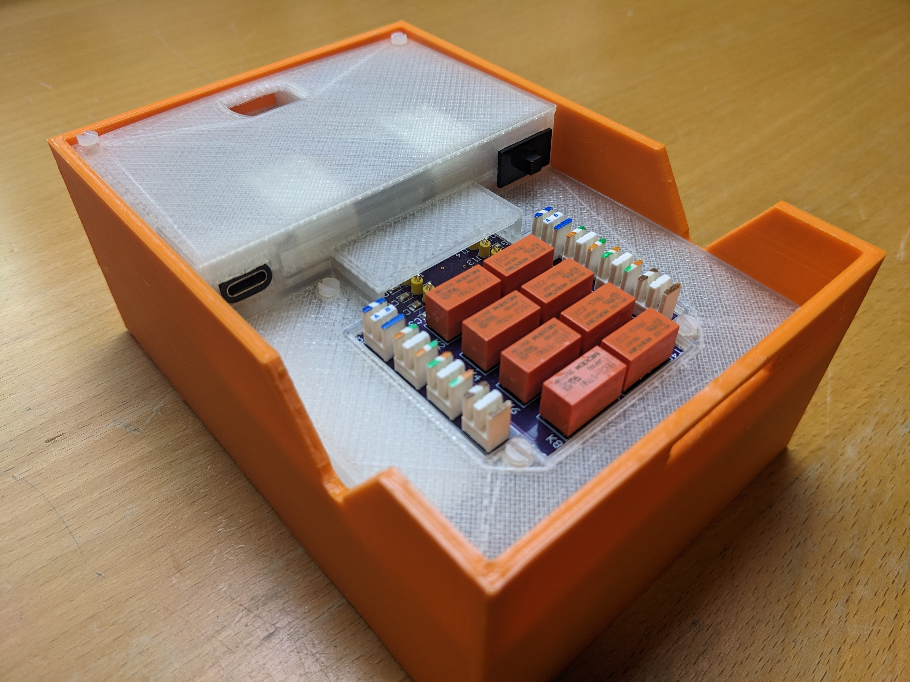

# EtherWeasel

A proof-of-concept for a hardware man-in-the-middle attack on an Ethernet network. For demonstration purposes this repository provides an implementation of a DNS cache poisoning attack which can edit DNS requests and responses in realtime to trick web clients into connecting to the wrong ip addresses.

## Video

Watch the video that goes with this repository for a quick demonstration of what EtherWeasel can do:
https://www.youtube.com/watch?v=TK0TTOAR--U

## Features

- Battery-operated
- Support for Gigabit Ethernet
- Remotely operated
- Friendly user-interface

## Inspiration

This project was inspired by the excellent work of Van Albert and Banks at DEFCON 23. I highly recommend watching their presentation [here](https://www.youtube.com/watch?v=RoOqznZUClI) and checking out their [GitHub repository](https://github.com/ervanalb/lens).

## Software Limitations

- No support for [DNSSEC](https://en.wikipedia.org/wiki/Domain_Name_System_Security_Extensions) (DNS Security Extensions)
- No support for [DoH](https://en.wikipedia.org/wiki/DNS_over_HTTPS) (DNS over HTTPS)
- No support for [DoT](https://en.wikipedia.org/wiki/DNS_over_TLS) (DNS over TLS)
- No support for [DANE](https://en.wikipedia.org/wiki/DNS-based_Authentication_of_Named_Entities)

## Hardware Limitations

- Insertion into a Gigabit Ethernet network causes momentary disruption. As far as I can tell there are 2 problems (there could be more, the 802.3 spec is really long). See [802.3-2018](https://ieeexplore.ieee.org/stamp/stamp.jsp?tp=&arnumber=8457469).

  1. `MDI/MDI-X`: A process where both interfaces figure out which twisted pairs are connected to what and if any of the pairs have their polarity flipped. Clause 40.4.4 on pg1639 has more details. If the two MitM interfaces are rapidly inserted, how would they know what MDI/MDI-X configuration to use? This information might be available in the FLP transmissions but even if it was these only happen every 16ms so the MitM interfaces would find out too late.

  2. `Auto-negotiation`: In addition to the dimensions of speed (10mb, 100mb, 1000mb), duplex (full, half) and port type (single, multi) which EtherWeasel might just guess, Gigabit Ethernet requires the two interfaces negotiate who is master and who is slave, where the slave will perform clock recovery. This is covered in clause 28 generally and clause 40.5 for Gigabit Ethernet specifically. If two MITM interfaces are inserted, how would they know to take the role of master of slave without triggering negotiation? Maybe Etherweasel could always assume slave, perform clock recovery and then wait 16ms for the next FLP and the clock wouldn't drift too much without a master? This aspect requires a lot more investigation.
