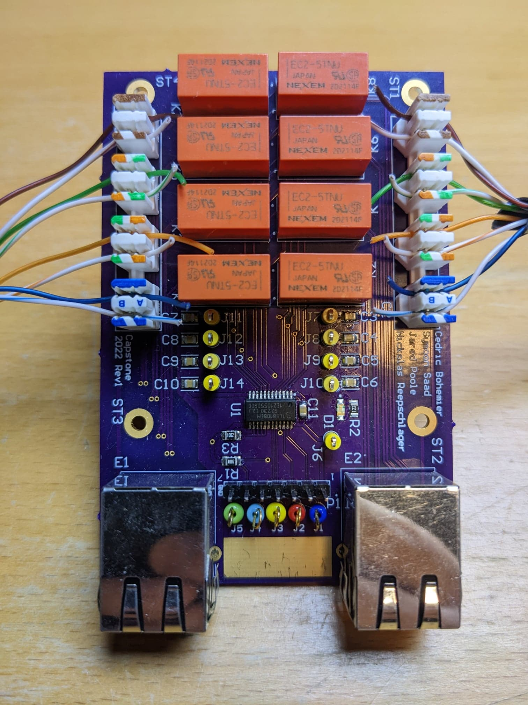
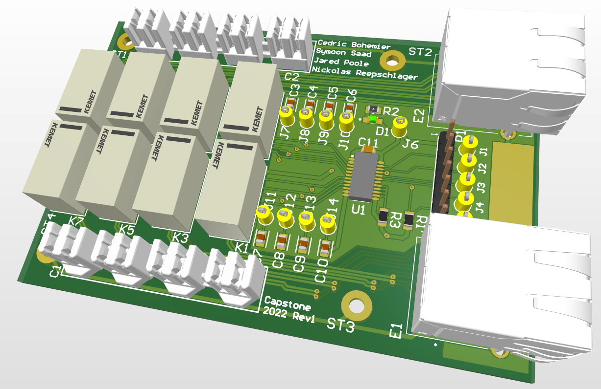
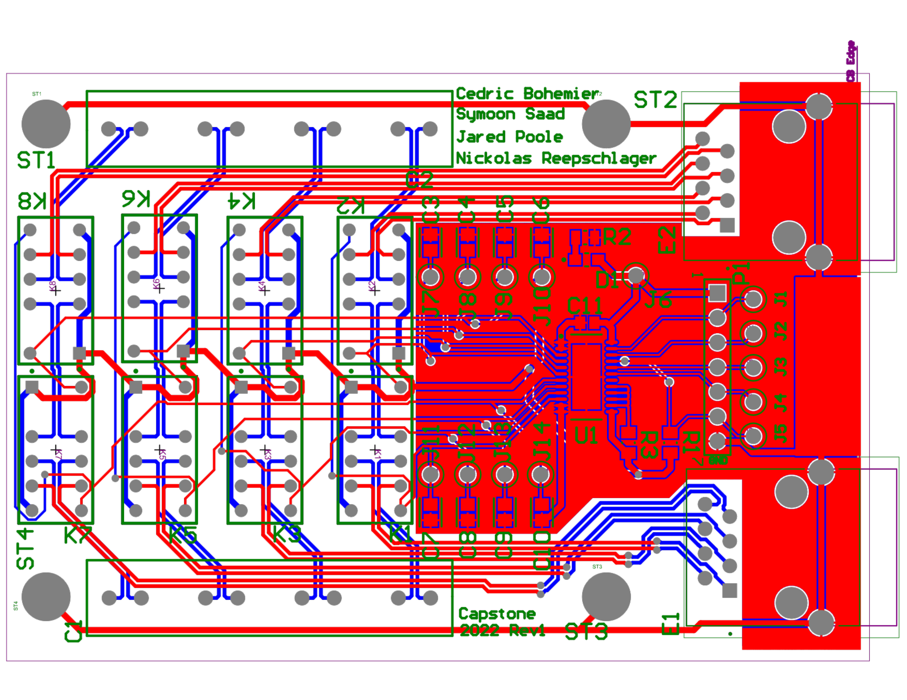
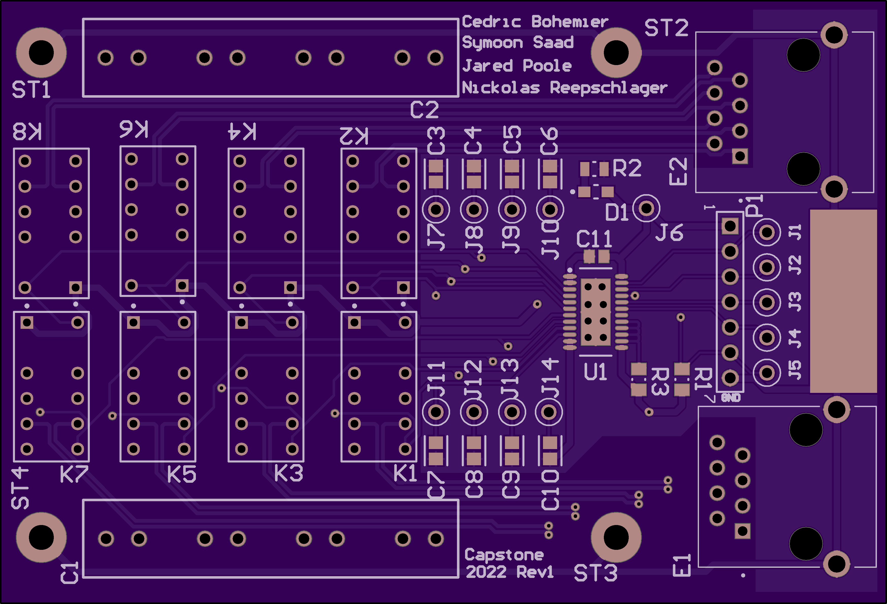

## Switching Board

The switching board consists of 8 latching relays and a low-side 8-channel relay driver with a SPI interface. We opted not to use RF relays because they are expensive. Because latching relays require 2 channels of control each (one to set, one to reset), they are driven in pairs. Punchdown connectors on both sides allow for rapid covert installation (shown in the picture). See the BOM for more details.

This switching board was designed using Altium Designer 23. If you wish to open the source files, you can get a viewer license for free [here](https://www.altium.com/documentation/altium-designer/viewer-license).

We elected to manufacture with [OSHpark](https://oshpark.com/) as they have excellent shipping options to Canada. Likely you will want to regenerate the gerber files and do a DRC again for a different manufacturer.

